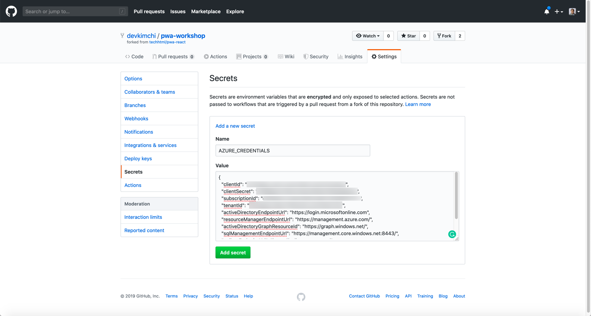
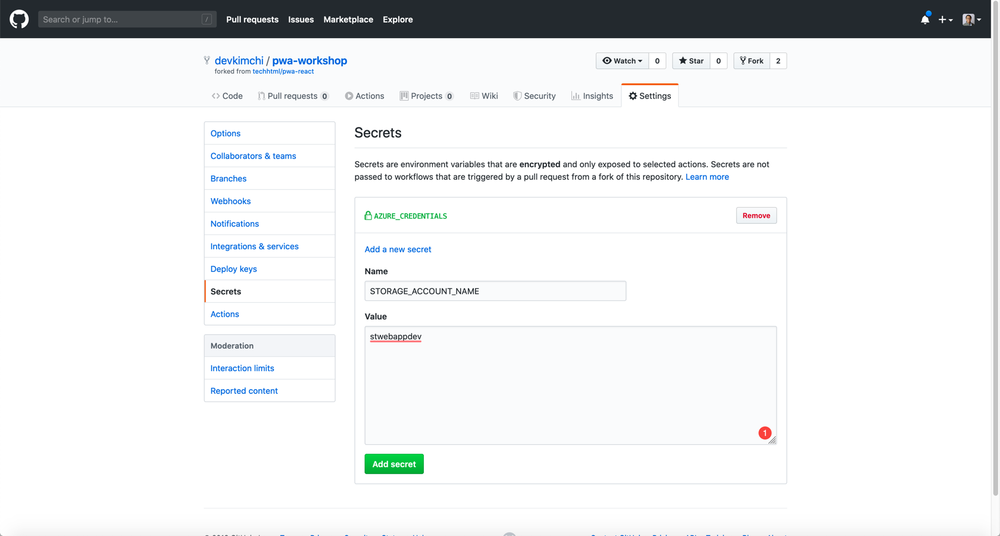

# 깃헙 액션을 통해 애저로 PWA 자동 배포 #

## 깃헙 액션 워크플로우 파일 생성 ##

아래와 같이 워크플로우 파일을 생성합니다.

* 디렉토리: `.github/workflows`
* 파일이름: `main.yaml`
* 파일내용:

```yaml
name: <WORKFLOW_NAME>
on: <EVENT>
jobs:
  <JOB_NAME>:
    runs-on: <RUNNER>
    steps:
    - name: <ACTION_NAME>
      uses: <ACTION>
```


## 깃헙 액션 워크플로우 파일 작성 ##

아래와 같이 워크플로우 파일을 수정합니다.

```yaml
name: Publish Static Web App to Azure Blob Storage

on: push

jobs:
  build_and_publish:
    runs-on: ubuntu-latest

    steps:
    - name: Checkout the repo
      uses: actions/checkout@v1
```

여기까지 수정한 후 워크플로우 파일을 리포지토리로 푸시합니다.

```bash
git add -A
git status
git commit -m <COMMIT_MESSAGE>
git push origin master
```

그리고 결과를 확인합니다. 다음에 아래 액션을 추가합니다.

```yaml
    - name: Login to Azure
      uses: Azure/login@v1
      with:
        creds: ${{ secrets.AZURE_CREDENTIALS }}
```

여기까지 수정한 후 푸시합니다. 그리고 결과를 확인합니다. 여기서 액션이 실패합니다.


### 애저 로그인 자격증명 설정 ###

아래 명령어를 통해 애저 로그인을 위한 자격증명 값을 생성합니다.

```bash
az ad sp create-for-rbac \
  -n <SERVICE_PRINCIPAL_NAME> \
  --sdk-auth
```

이 명령어 실행 결과로 만들어지는 JSON 객체 값을 시크릿 변수 `AZURE_CREDENTIALS`에 할당합니다. 이 때 JSON 객체에 들어있는 `clientId` 값을 잘 기억해 둡니다.



깃헙 리포지토리의 액션 탭에서 다시 워크플로우를 실행시킵니다. 이제는 성공합니다. 다음에 아래 액션을 추가합니다.

```yaml
    - name: Install npm packages
      shell: bash
      run: |
        npm install

    - name: Build app
      shell: bash
      run: |
        npm run build

    # - name: Test app
    #   shell: bash
    #   run: |
    #     npm run test
```

여기까지 수정한 후 푸시합니다. 그리고 결과를 확인합니다. 다음에 아래 액션을 추가합니다. 다시 실패하는 것을 확인합니다.

```yaml
    - name: Publish app
      uses: Azure/cli@v1.0.0
      with:
        azcliversion: latest
        inlineScript: |
          az storage blob upload-batch -s build -d \$web --account-name ${{ secrets.STORAGE_ACCOUNT_NAME }}
```


### 애저 블롭 저장소 이름 설정 ###

마찬가지로 `STORAGE_ACCOUNT_NAME` 값을 애저 블롭 저장소 이름으로 설정합니다.



깃헙 리포지토리의 액션 탭에서 다시 워크플로우를 실행시킵니다. 이제는 성공합니다.


## 실습 ##

* ✅[Step 01](step-01.md)
* ✅[Step 02](step-02.md)
* ✅Step 03
* 🔲[Step 04](step-04.md)
