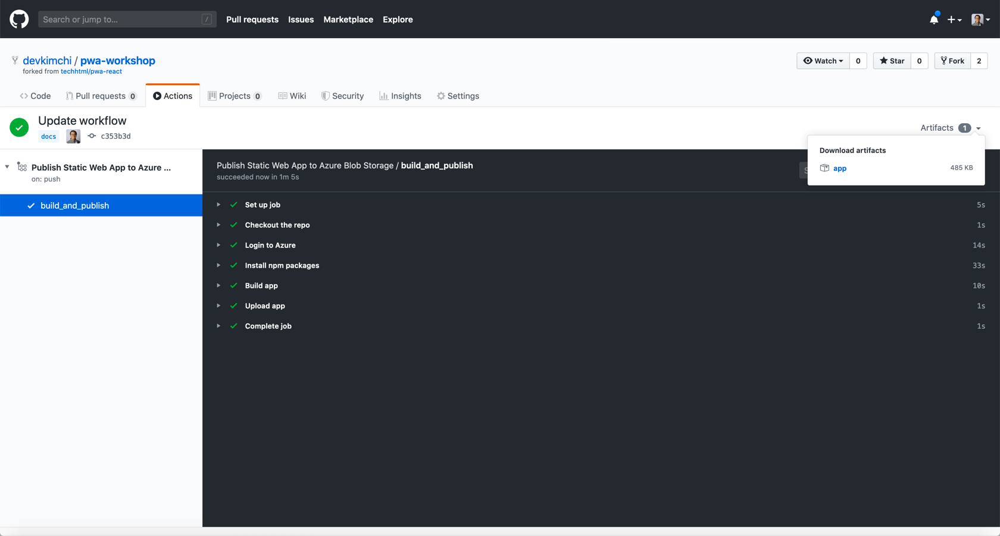
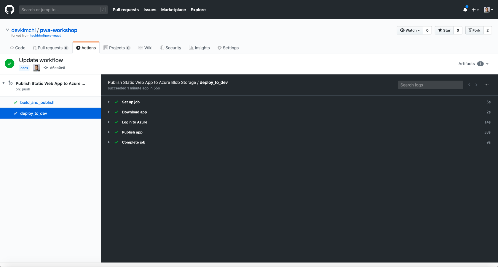

# 깃헙 액션으로 CI/CD 구현 #

## 빌드에서 배포 분리 ##

`build_and_publish` 잡의 마지막 액션을 아래와 같이 바꿔 줍니다.

```yaml
    - name: Upload app
      uses: actions/upload-artifact@v1
      with:
        name: app
        path: build
```

여기까지 수정한 후 워크플로우 파일을 리포지토리로 푸시합니다.

```bash
git add -A
git status
git commit -m <COMMIT_MESSAGE>
git push origin master
```

그리고 결과를 확인합니다.




## 배포 잡 설정 ##

아래와 같이 배포 잡을 추가합니다.

```yaml
  deploy_to_dev:
    needs: build_and_publish
    runs-on: ubuntu-latest

    steps:
    - name: Download app
      uses: actions/download-artifact@v1
      with:
        name: app
        path: build

    - name: Login to Azure
      uses: Azure/login@v1
      with:
        creds: ${{ secrets.AZURE_CREDENTIALS }}

    - name: Publish app
      uses: Azure/cli@v1.0.0
      with:
        azcliversion: latest
        inlineScript: |
          az storage blob upload-batch -s build -d \$web --account-name ${{ secrets.STORAGE_ACCOUNT_NAME }}
```

여기까지 수정한 후 워크플로우 파일을 리포지토리로 푸시하고 결과를 확인합니다.



잡을 하나 더 추가합니다.

```yaml
  deploy_to_prod:
    needs: deploy_to_dev
    runs-on: ubuntu-latest

    steps:
    - name: Download app
      uses: actions/download-artifact@v1
      with:
        name: app
        path: src/WebApp/dist

    - name: Login to Azure
      uses: Azure/login@v1
      with:
        creds: ${{ secrets.AZURE_CREDENTIALS }}

    - name: Publish app
      uses: Azure/cli@v1.0.0
      with:
        azcliversion: latest
        inlineScript: |
          az storage blob upload-batch -s $GITHUB_WORKSPACE/src/WebApp/dist -d \$web --account-name ${{ secrets.STORAGE_ACCOUNT_NAME_2 }}
```

여기까지 수정한 후 워크플로우 파일을 리포지토리로 푸시하고 결과를 확인합니다.

![그림]


## 풀 리퀘스트에만 반응하는 워크플로우 만들기 ##

이제 `master` 브랜치에서 `dev` 브랜치를 하나 만듭니다.

```bash
git checkout -b dev
```

아래 순서대로 파일을 수정합니다.

* 앞서 작성한 `main.yaml` 파일을 복사한 후 이름을 `pr.yaml`로 바꿔줍니다.
* 배포 잡은 모두 삭제합니다.
* 첫번째 `build_and_publish` 잡 이름을 `build_and_test`로 바꿉니다.
* 마지막 `upload_artifact` 액션을 삭제합니다.
* `on` 속성에 `push`로 되어 있는 값을 `pull_request`로 바꿔줍니다.

이렇게 한 후 저장하고 리포지토리로 푸시합니다. 그리고 그 결과를 확인합니다. 원래 `main.yaml` 워크플로우만 실행이 되었습니다.

![그림]

이제 `dev` 브랜치에서 `master` 브랜치로 풀 리퀘스트를 만들어 봅니다. 그리고, 파이프라인 실행 결과를 확인합니다. `pr.yaml` 워크플로우만 실행이 되었습니다.

![그림]
